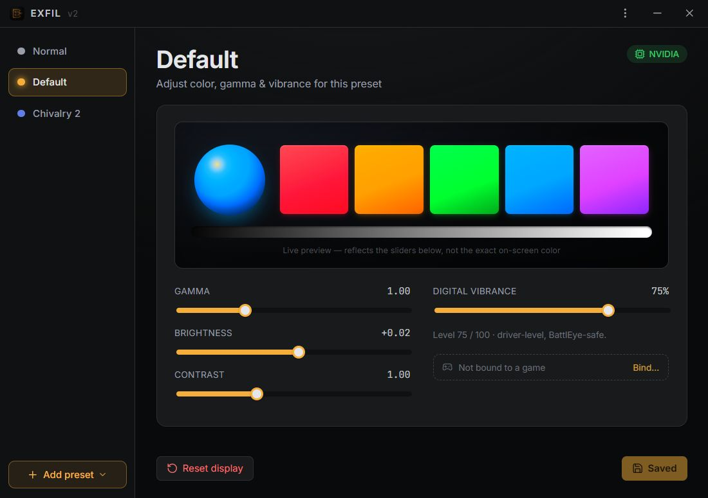

<p align="center">
  
</p>

<h1 align="center">EXFIL</h1>

<p align="center">
  Per-game color, gamma &amp; digital-vibrance presets for Windows.<br/>
  Driver-level only — <strong>no injection, BattlEye / EAC-safe</strong>. No telemetry.
</p>

<p align="center">
  
</p>

## Install

1. Download the latest `EXFIL_x.y.z_x64-setup.exe` from **[Releases](../../releases)** and run it.
2. Windows will likely show a SmartScreen warning ("Windows protected your PC") because the
   installer is unsigned — click **More info → Run anyway**.
3. That's it. EXFIL lives in the system tray, starts with Windows (toggleable in
   Settings — the titlebar cogwheel), and installs per-user (no admin needed). The
   installer embeds the WebView2 bootstrapper, so it works on machines that don't
   have WebView2 yet.

**Requirements:** Windows 10/11 x64. Gamma/brightness/contrast work on any GPU;
**digital vibrance needs an NVIDIA or AMD GPU** (on Intel or anything else the
slider simply disables itself and everything else keeps working).

More detail on running it on a machine that isn't yours — HDR caveats, AV false positives,
sharing presets — in [`DISTRIBUTING.md`](./DISTRIBUTING.md).

## What it does

- **Gamma / brightness / contrast** — driver-level GDI gamma ramps (`Set/GetDeviceGammaRamp`),
  applied to **every gamma-capable monitor** (`\\.\DISPLAY1..N`, probed live).
- **Digital vibrance** — on NVIDIA via NVAPI (`SetDVCLevelEx`, raw `nvapi64.dll`
  `QueryInterface`); on AMD via ADL display saturation (raw `atiadlxx.dll`, the same
  control Radeon software exposes). Either way it's applied to **every connected
  output** so a second monitor never keeps a stale value.
- **Your own presets** — a fixed read-only **Normal** baseline (restores each monitor's
  native color) plus presets you create, rename, and delete, tuned live from the color
  controls. Persisted per-user; the last-active preset re-applies on boot.
- **Per-game auto-switch** — bind a preset to a program and EXFIL applies it automatically
  while that program runs, reverting when it exits. Create a preset straight from a running
  game (**Add preset → From a running program…**), or bind/unbind from the preset's
  right-click menu or the main panel. Detection is a read-only window/process enumeration —
  no injection, no hooks.
- **Global hotkeys** — **Ctrl+Shift+F9** cycles through your presets, **Ctrl+Shift+F10**
  snaps back to Normal — from inside a game, with EXFIL hidden in the tray (toggleable
  in Settings).
- **Lives in the tray** — closing the window hides to tray; the tray menu has
  **Show / Reset display / Quit**. The active ramp is re-asserted on an interval so
  fullscreen games can't permanently steal the gamma.
- **Always exits clean** — every exit path (tray Quit, OS shutdown) restores native
  gamma + vibrance, so the screen is never left tinted with no app to clear it.
- **Import / export** — share presets as JSON (Settings page); import is additive, never
  overwrites, and rescales vibrance when the file came from a machine with the other
  GPU vendor.

## Anti-cheat safety

EXFIL never touches game processes. Gamma goes through the Windows display driver
(GDI), vibrance through NVIDIA's public NVAPI or AMD's public ADL, and the auto-switch
watcher only *reads* the process list (`CreateToolhelp32Snapshot` / `EnumWindows`) — no
DLL injection, no hooks, no memory access. This is the same class of access the NVIDIA
Control Panel, AMD Radeon software, and Windows itself use, which is what keeps it
BattlEye / EAC-safe.

## Build from source

```bash
npm install
npx @tauri-apps/cli dev      # hot-reload dev
npx @tauri-apps/cli build    # release exe + NSIS installer
```

Outputs land in `src-tauri/target/release/` (or `%CARGO_TARGET_DIR%\release\` if you set
one): `exfil-v2.exe` and `bundle/nsis/EXFIL_x.y.z_x64-setup.exe`.

Tagged pushes (`v*`) build the installer on CI and attach it to a draft GitHub Release
(see [`.github/workflows/release.yml`](.github/workflows/release.yml)).

**Stack:** Svelte 5 (runes) · SvelteKit (adapter-static SPA) · Vite · hand-authored OKLCH
CSS · TypeScript · Tauri 2 · Rust 2021 · `windows` crate (GDI) · raw NVAPI + AMD ADL FFI.

## Data

Presets live at `%APPDATA%\exfil-v2\presets.json` — created fresh on first run,
per-user, nothing else is written anywhere. No telemetry, no analytics, no crash
reporting.

## License

[MIT](./LICENSE)
